# 1. 简单算数逻辑单元

### 电路实现

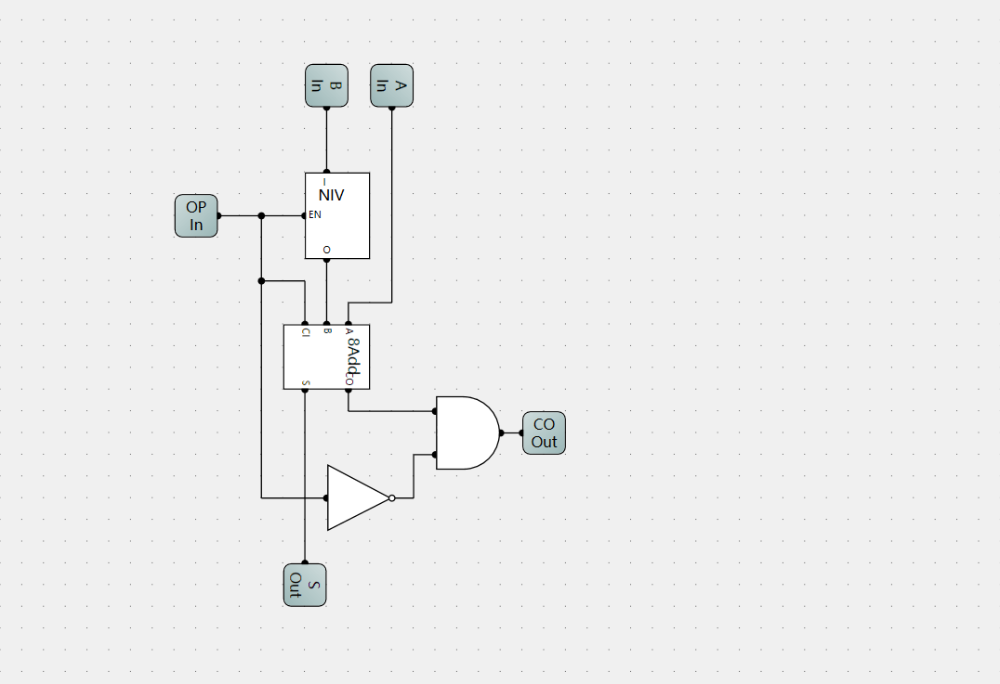

- **A,B是两个8位数输入**
- **OP是加减选择，为1时做减法，为0时做加法**
- **S是输出端，CO是进位输出端**

# 2. 半自动加法机

### 电路实现

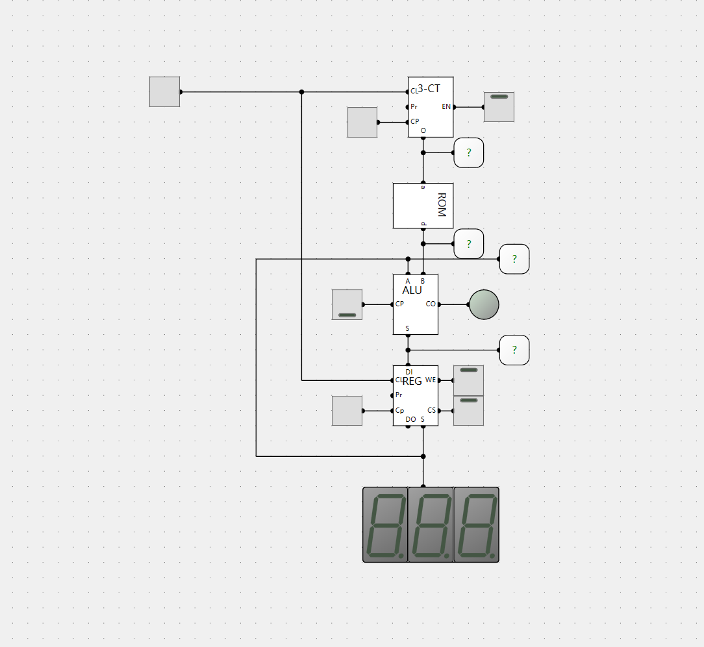

- **三位计数器用来遍历ROM里所有地址的数据**
- **ALU负责做加法运算**
- **寄存器暂存加法运算后的数据**

**计算步骤**

- **上电之后，将计数器和寄存器都被置为0。然后打开计数器使能，寄存器使能,寄存器写有效**
- **给寄存器一个时钟信号，将ROM里0地址的数写到加法器的A输入端。**
- **然后给计数器一个时钟信号，读出ROM中1地址的数据。ALU经过加法运算后输出到寄存器的输入。**

- **给寄存器一个时钟信号，把结果再写到A端**

- **依次循环，即可实现半自动加法。**

# 3. 启动选项

### 电路实现

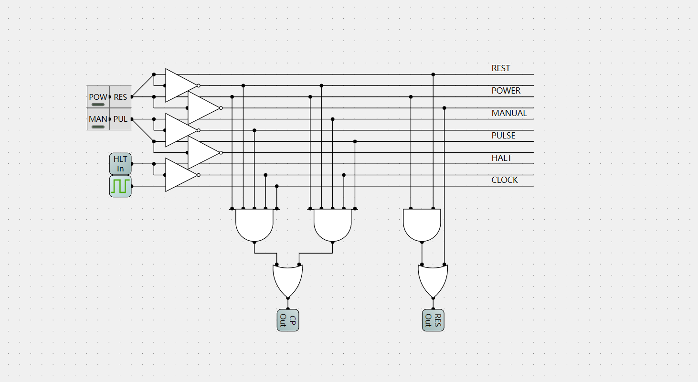

- **`POW`：启动开关，1启动，0关闭**
- **`MAN`：手动脉冲开关，1手动时钟，0自动时钟**
- **`RES`：复位按键，按下之后总线提供一个复位信号**
- **`PUL`：手动时钟按键，通过该按键手动提供时钟信号**
- **`HLT`：停止信号输入，当接受到外部提供一个停止信号，时钟信号就被关闭**
- **`CLOCK`：内部提供一个时钟输入**
- **`RES`：复位输出信号，发出一个复位信号**
- **`CP`：时钟输出，提供时钟信号**

**提供两种时钟信号的方式，分别是时钟信号和手动脉冲信号，受MAN的控制**

# 4. 自动加法器

### 电路实现

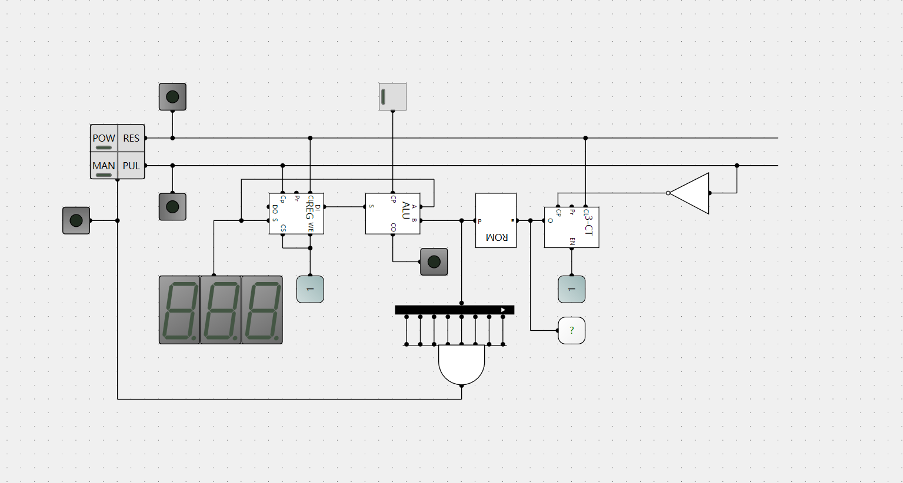

- **启动仿真，按下复位按钮**
- **按下POW，启动全自动加法机，此时时钟信号打开，复位信号关闭**
- **第一个上升沿，寄存器执行写操作，将ROM的0地址数据写到A输入口；**
- **第一个下降沿，对应计数器的第一个上升沿，计数器+1，ROM地址+1，读出ROM的1地址数据。**
- **依次类推，实现全自动加法机**

# 5.程序计数器

### 电路实现

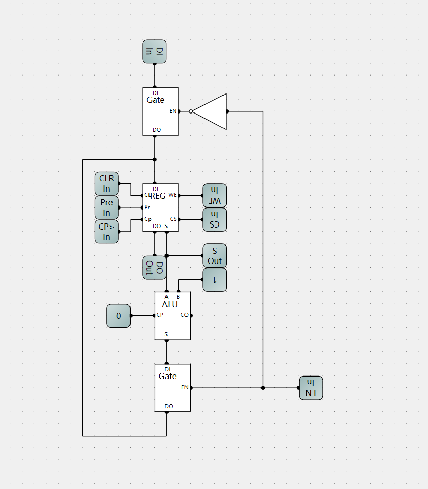

- **`EN`：三态门使能，在输入输出端分别加上三态门用来隔离总线；EN=1输出(计数)，EN=0输入(预置数)**

# 6. 内存控制器

### 电路实现

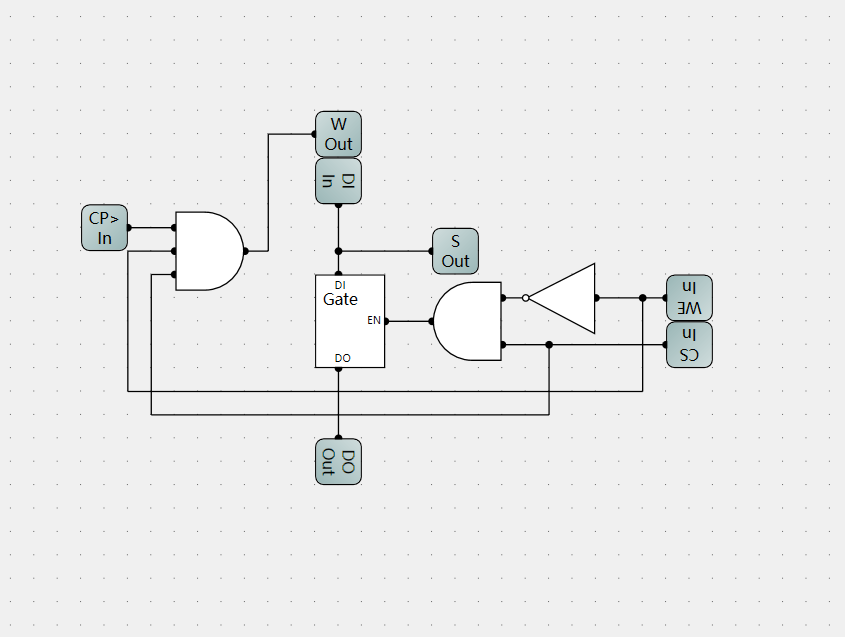

# 7.微程序控制

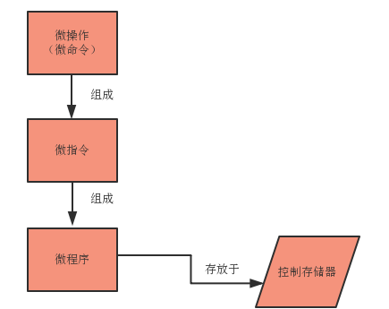

#### 微指令

**在微程序控制的计算机中，将由同时发出的控制信号所执行的一组为操作称为微指令（也称为微命令），所以微指令就是把同时发出控制信号的有关信息汇集起来而形成的。**

#### 微程序

**计算机的程序由指令序列构成，而计算机每条指令的功能均由微指令序列解释完成，这些为指令序列的集合就叫做为程序。**

#### 控制存储器

**为程序一般是存放在专用的存储器中的，由于该存储器主要存放控制信号（命令）与下一条执行的微指令地址（简称下址），所以被叫做控制存储器。**

**一般计算机指令系统是固定的，所以实现指令系统的微程序也是固定的，于是控制存储器可以用ROM（只读存储器）实现。**

**（又由于机器内控制信号数量比较多，再加上决定下址的地址码有一定宽度，所以控制存储器的字长比机器字长要长得多。）**

# 8. ALU扩充

### 电路实现

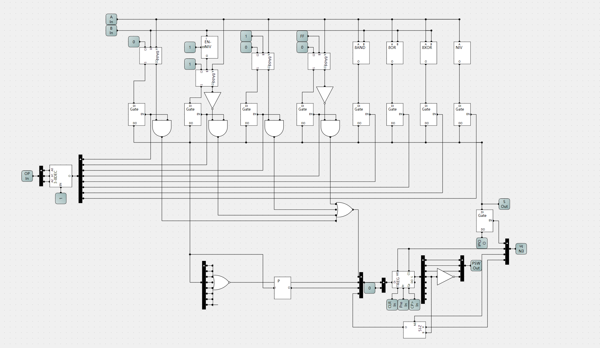

#### 逻辑运算选择

- **OP=0B000:加法**

- **OP=0B001:减法**

- **OP=0B010:加1**

- **OP=0B011:减1**

- **OP=0B100:与运算**
- **OP=0B101:或运算**
- **OP=0B110:异或运算**
- **OP=0B111:取反**

#### 程序状态字(由低到高)

- **溢出位:加法溢出时置1;减法时,可以比较两数大小,A>B置0,A<B置1**
- **零:输出为0时置1**
- **奇偶:输出1的个数为奇数时置1**
- **中断位:发生中断时置1**

# 9. 寄存器控制器

### 电路实现

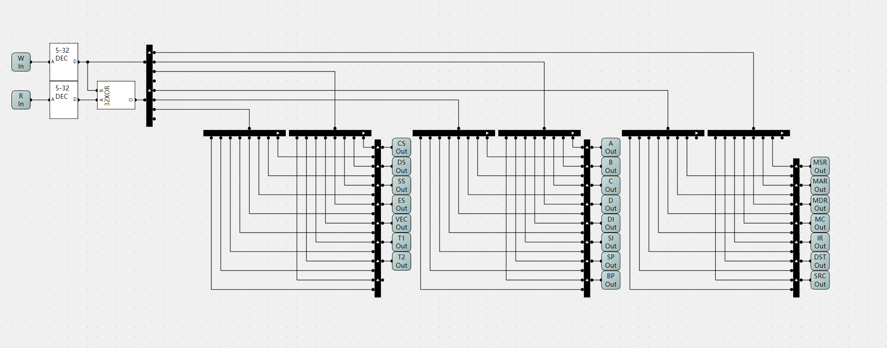

- **输入端W和R共五位最多可控制32个元器件**
- **使用32位异或门防止单个器件的同时读写**
- **输出端连接元器件的控制端(WE和CS)**
- **控制进行写操作时,输出控制信号为0B11**
- **控制进行读操作时,输出控制信号为0B10**
- **控制信号低位控制WE端,高位控制CS端**

# 10. 寄存器读写控制器

### 电路实现

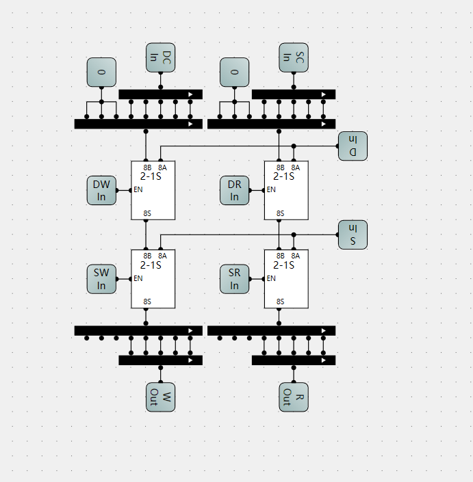

- **控制RSC和DST寄存器中表示的寄存器**

# 11. 控制单元

### 电路实现

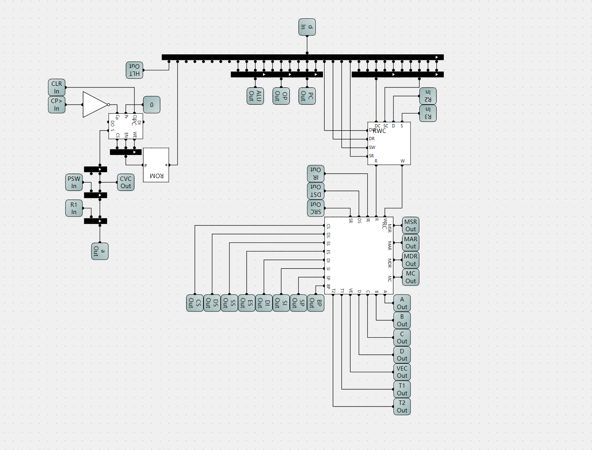
